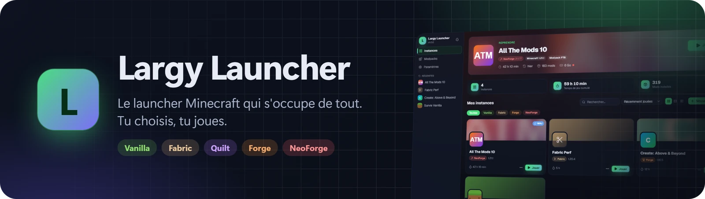
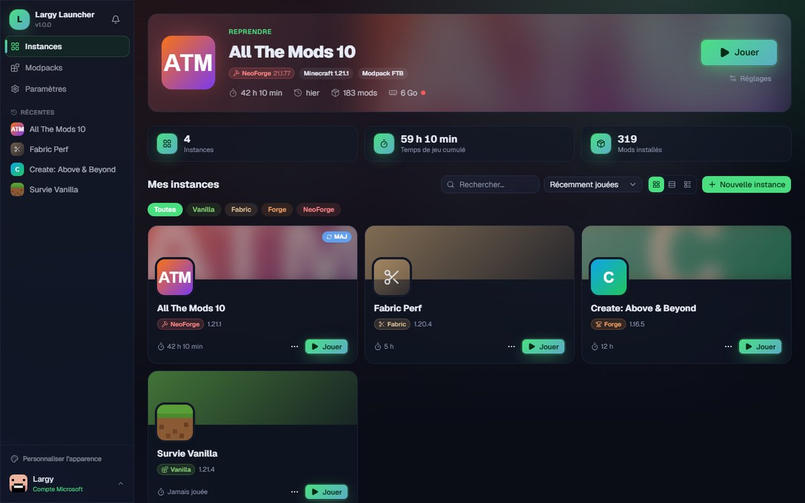
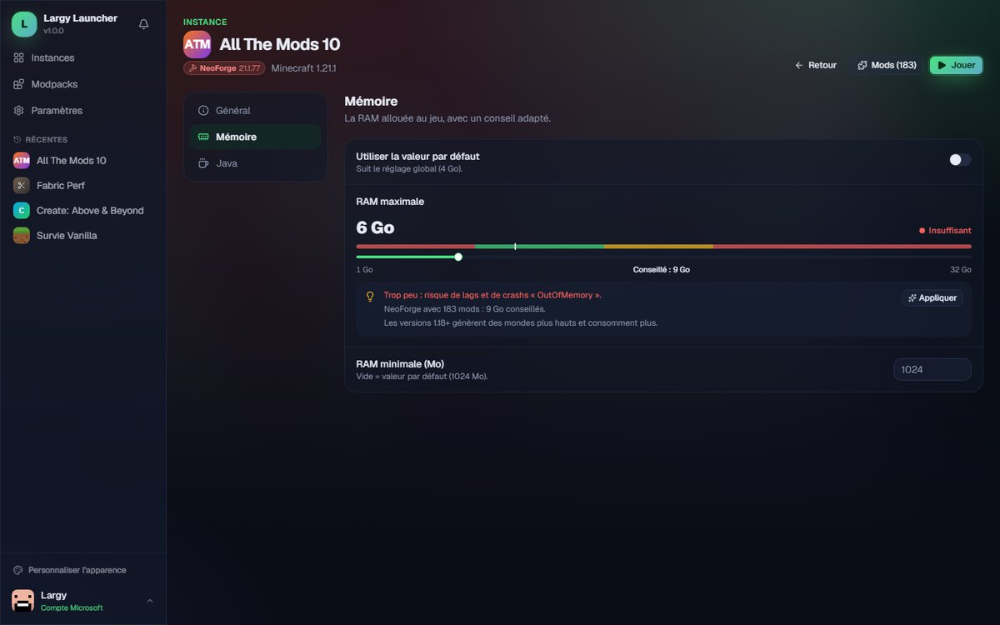
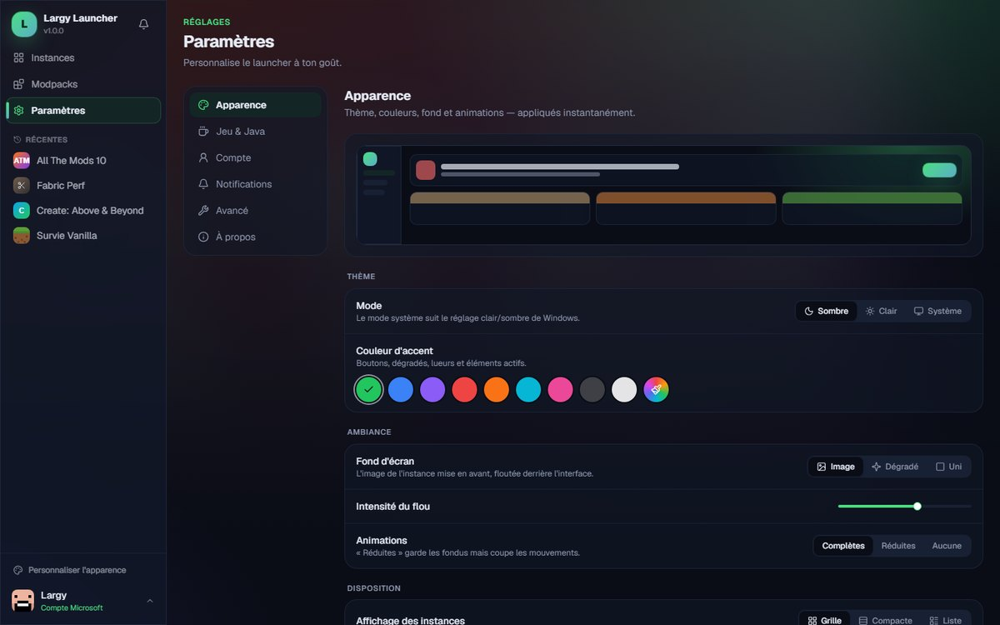
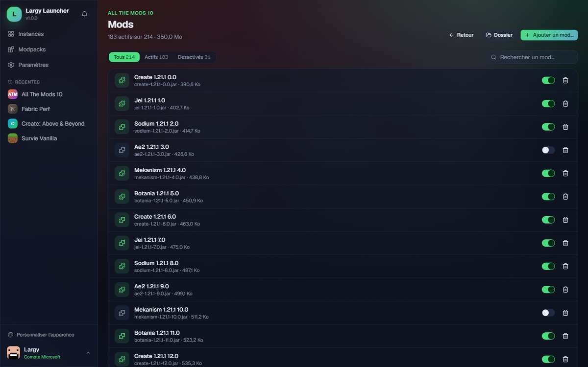
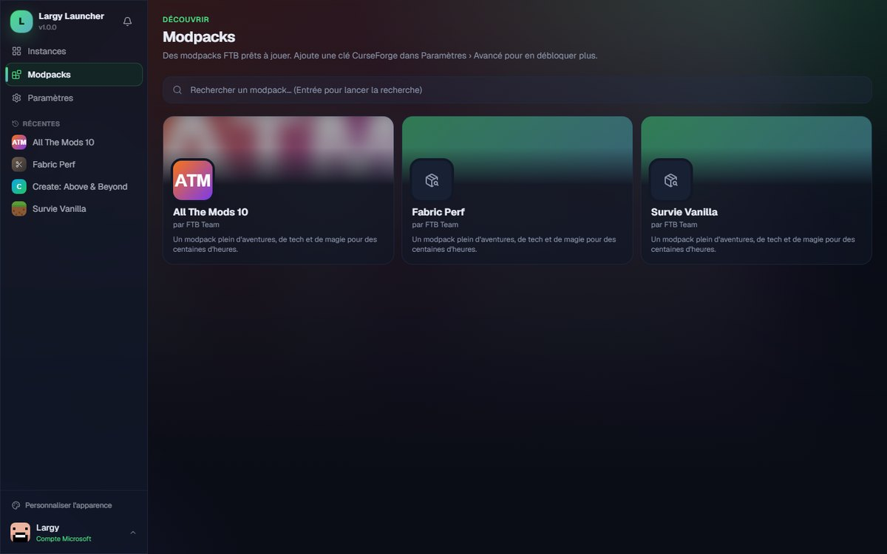
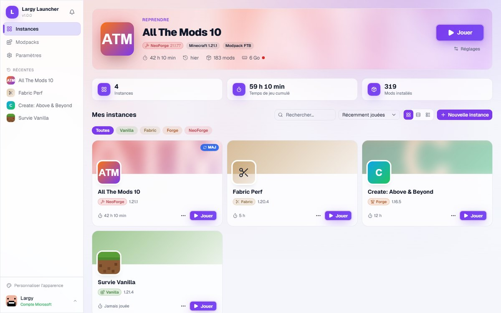

<div align="center">



<br>

<a href="https://github.com/Largy-dev/Largy-Launcher/releases/latest/download/LargyLauncher-Setup.exe">
  
</a>

<sub><a href="https://github.com/Largy-dev/Largy-Launcher/releases">Toutes les versions</a> · Windows 10 et 11 · Gratuit</sub>

<br><br>

**Un launcher Minecraft beau et simple, qui s'occupe de tout.**<br>
Java, mod loaders, modpacks, mods, mémoire, mises à jour… tu choisis ton instance, tu cliques sur **Jouer**.

</div>

<br>



## Sommaire

- [Installer](#installer)
- [Fonctionnalités](#fonctionnalités)
- [Aperçu](#aperçu)
- [Questions fréquentes](#questions-fréquentes)
- [Pour les développeurs](#pour-les-développeurs)

## Installer

1. Télécharge **`LargyLauncher-Setup.exe`** avec le bouton en haut de la page.
2. Lance-le : l'installation prend quelques secondes.
3. Ouvre Largy Launcher et connecte-toi avec ton **compte Microsoft**. C'est tout.

Le launcher **se met à jour tout seul** : quand une nouvelle version sort, il te la propose au
démarrage et l'installe en un clic.

> [!NOTE]
> **Windows affiche « Windows a protégé votre ordinateur » ?** C'est normal pour un logiciel
> indépendant sans certificat payant : clique sur **Informations complémentaires → Exécuter quand
> même**.

## Fonctionnalités

### Jouer

| | |
|---|---|
| **Un clic pour jouer** | La bannière d'accueil reprend ta dernière partie. Java est téléchargé automatiquement, dans la bonne version pour chaque Minecraft. |
| **Tous les mod loaders** | Vanilla, **Fabric**, **Quilt**, **Forge** (y compris 1.7.10 → 1.12.2) et **NeoForge**, chaque instance dans son propre dossier. |
| **Lancement suivi en direct** | Étapes, vitesse de téléchargement et temps restant, puis RAM et processeur pendant la partie. Un lancement peut être annulé à tout moment. |
| **La bonne quantité de RAM** | Une mémoire conseillée par instance, selon le loader, le nombre de mods et la RAM de ton PC. |
| **Directement sur ton serveur** | Rejoins un serveur dès le lancement, choisis la taille de la fenêtre ou le plein écran. |
| **Même sans internet** | Une instance déjà installée se lance hors connexion, avec ton compte Microsoft (en solo). |

### Modpacks et mods

| | |
|---|---|
| **Modpacks Modrinth, FTB et CurseForge** | Parcours des milliers de packs et installe-les en un clic. Une mise à jour sauvegarde d'abord tes mondes et garde tes options de jeu. |
| **Mods, resource packs et shaders** | Cherche dans le catalogue Modrinth : seul ce qui est compatible avec ton instance s'affiche, et les dépendances s'installent toutes seules. |
| **Mises à jour des mods** | Le launcher repère les mods qui ont une version plus récente et les met à jour en un clic. |
| **Import et export** | Glisse un `.mrpack`, un zip CurseForge ou une instance Prism/MultiMC sur la fenêtre pour l'importer. Exporte n'importe quelle instance en `.mrpack` pour la partager. |
| **Gestion locale** | Active, désactive ou supprime un mod, glisse des `.jar` sur la fenêtre pour les ajouter. |

### Au quotidien

| | |
|---|---|
| **Plusieurs comptes** | Connecte plusieurs comptes Microsoft et passe de l'un à l'autre depuis la barre latérale. Un mode hors-ligne existe aussi pour jouer sans compte. |
| **Toujours là** | Réduis le launcher dans la zone de notification : il continue de compter ton temps de jeu et de surveiller les crashs. |
| **Comprendre un crash** | Logs colorés et filtrables, diagnostic clair des causes fréquentes (mémoire, mods incompatibles, pilote graphique, Java…) et accès direct au crash report. |
| **Entretien des instances** | Dupliquer, réparer (vérification de chaque fichier), sauvegarder les mondes, choisir le Java utilisé. |
| **Tes stats** | Temps de jeu par instance et au total, dernière partie, nombre de mods. |
| **À ton goût** | Thème sombre, clair ou système, 9 couleurs d'accent ou la tienne, fond flouté de ton modpack, taille de l'interface, animations réglables. |

## Aperçu

| | |
|---|---|
|  |  |
| **Conseil de RAM** adapté à chaque instance | **Personnalisation** appliquée en direct |
|  |  |
| **Gestion des mods** avec recherche et filtres | **Modpacks** installables en un clic |



## Questions fréquentes

<details>
<summary><b>Je ne vois pas l'onglet CurseForge.</b></summary>

<br>

CurseForge demande une clé personnelle, gratuite :

1. Va sur [console.curseforge.com](https://console.curseforge.com/) et connecte-toi.
2. Génère une clé API (section **API Keys**).
3. Colle-la dans **Paramètres › Avancé › Clé API CurseForge**.

L'onglet apparaît aussitôt. Cette clé est personnelle : ne la partage pas (les
[conditions de CurseForge](https://support.curseforge.com/support/solutions/articles/9000207405)
l'interdisent). Modrinth et FTB fonctionnent sans clé.
</details>

<details>
<summary><b>Des fichiers d'un modpack sont « à télécharger à la main ».</b></summary>

<br>

Certains auteurs CurseForge interdisent le téléchargement par les launchers. Le launcher liste ces
fichiers avec un lien vers leur page et un bouton pour ouvrir le dossier `mods` : télécharge-les,
glisse-les dedans, c'est prêt.
</details>

<details>
<summary><b>Combien de RAM mettre ?</b></summary>

<br>

Regarde la pastille de couleur dans **Réglages de l'instance › Mémoire** : vert, c'est bon. Le bouton
**Appliquer** met directement la valeur conseillée.
</details>

<details>
<summary><b>Le jeu ne se lance plus ou crash au démarrage.</b></summary>

<br>

Ouvre **Réglages de l'instance › Général › Réparer** : chaque fichier du jeu et du mod loader est
vérifié et retéléchargé si besoin. Si le problème continue, le diagnostic de crash et le journal du
launcher (**Paramètres › Avancé › Journal du launcher**) aident à trouver la cause.
</details>

<details>
<summary><b>Je veux fermer complètement le launcher.</b></summary>

<br>

Clic droit sur son icône dans la zone de notification → **Quitter**. Le comportement du bouton de
fermeture (demander, réduire ou quitter) se règle dans **Paramètres › Jeu & Java**.
</details>

---

## Pour les développeurs

Construit avec **Tauri 2** (backend Rust) et **React 19 + TypeScript** (interface). Cible : Windows.

### Lancer en local

```bash
npm install
npm run tauri dev
```

Build : `npm run tauri build` → `src-tauri/target/release/bundle/nsis/*-setup.exe`.

### Tests

```bash
# Backend : 150 tests unitaires + lint
cd src-tauri && cargo test && cargo clippy --all-targets -- -D warnings

# Frontend : types, lint, format, 64 tests Vitest
npx tsc --noEmit && npm run lint && npm run format:check && npm test

# Bout en bout contre les vrais services (~300 Mo, hors CI)
cd src-tauri && cargo test --test smoke -- --ignored --nocapture --test-threads=1
```

Le test de bout en bout installe réellement Java, Fabric, Quilt, Forge 1.20.1 (processeurs
compris), Forge 1.12.2, NeoForge 1.21.1 / 1.20.1, et résout des modpacks Modrinth et FTB.
`LARGY_SMOKE_DIR` permet de garder son cache entre deux lancements.

### Stack

| Techno | Rôle |
|---|---|
| **Tauri 2** | Fenêtre native légère, icône de notification, updater signé, notifications Windows. |
| **Rust** (`src-tauri/`) | Auth, téléchargements, instances, Java, mod loaders, providers, lancement. |
| **React 19 + TypeScript** (`src/`) | Interface. |
| **Tailwind CSS v4 + shadcn/ui** | Styles et composants ; thème par tokens CSS (`src/index.css`). |
| **Motion** | Animations, coupées selon la préférence de l'utilisateur. |
| **TanStack Query / Zustand** | Cache des données du backend / état global et préférences. |
| **reqwest / tokio** | HTTP asynchrone (Mojang, Microsoft, Modrinth, FTB, CurseForge). |
| **keyring** | Tokens Microsoft et Minecraft dans le Gestionnaire d'identification Windows. |

### Comment ça marche

- **Auth** (`auth/`) — flux « device code » Microsoft → Xbox Live → XSTS → Minecraft Services.
  Plusieurs comptes ; le token Minecraft (24 h) est mis en cache, donc pas de requête au démarrage,
  et la session en cache sert de repli sans réseau ou en cas de limite de requêtes (429). Le token
  ne quitte jamais le backend.
- **Téléchargements** (`download/`) — écriture progressive sur disque avec SHA-1 incrémental,
  3 tentatives, fichiers temporaires uniques, vérification rapide (taille) ou complète (réparation).
- **Métadonnées** (`util/http_cache.rs`) — manifestes Mojang, profils de loaders et index Java
  mis en cache avec repli sur la copie locale : une instance installée se lance hors connexion.
- **Mod loaders** (`modloaders/`) — Fabric et Quilt fusionnent un profil JSON ; Forge et NeoForge
  exécutent la chaîne de processeurs de leur installeur (`forge_common/`), avec le format legacy
  pour Forge ≤ 1.12.2.
- **Modpacks** (`providers/`) — trait `ModpackProvider` pour Modrinth (`.mrpack`), FTB et
  CurseForge (résolution groupée). Archives extraites sans zip-slip, chemins toujours validés.
- **Lancement** (`launch/`) — l'instance est verrouillée dès la préparation (annulable), logs
  envoyés par lots, protection Log4Shell, analyse des crashs à la sortie.

### Structure

```
src-tauri/src/
  auth/          Microsoft, Xbox, Minecraft Services, comptes, coffre de tokens
  download/      moteur de téléchargement
  instances/     instances, mods, contenu Modrinth, import, export, sauvegardes
  java/          runtimes Mojang et détection des Java installés
  launch/        préparation, lancement, logs, détection de crash
  minecraft/     manifestes, bibliothèques, assets, arguments
  modloaders/    Fabric/Quilt, Forge, NeoForge
  providers/     Modrinth, FTB, CurseForge, archives
  util/          écriture atomique, cache HTTP, versions
src/
  screens/       Instances, Modpacks, Paramètres, Réglages d'instance, Mods, Lancement
  components/    shell, instance, launch, console, settings, ui
  hooks/ lib/ store/ services/
```

> [!WARNING]
> Ne nomme jamais un dossier source `logs` : le `.gitignore` l'ignorerait, et Tailwind ne
> scannerait pas ses classes.

### Publier une version

1. Mets la même version dans `package.json`, `package-lock.json`, `src-tauri/Cargo.toml`
   (+ `Cargo.lock`) et `src-tauri/tauri.conf.json`.
2. Tagge et pousse :

```bash
git tag -a v1.0.2 -m "v1.0.2"
git push origin main v1.0.2
```

Le tag déclenche `.github/workflows/release.yml` : vérification que le tag correspond à la
version de l'app, build, release GitHub avec l'installeur, `latest.json` signé pour l'auto-update et
une copie `LargyLauncher-Setup.exe` au nom fixe pour le bouton de téléchargement. Chaque push et pull
request passe par `.github/workflows/ci.yml` (tests, clippy, tsc, lint, format).

**Auto-update** : `tauri-plugin-updater` lit `releases/latest/download/latest.json`. Les artefacts
sont signés avec une clé privée (secret GitHub `TAURI_SIGNING_PRIVATE_KEY`, jamais dans le dépôt) ;
la clé publique est dans `src-tauri/tauri.conf.json`.

### Utiliser ta propre application Azure

L'application Azure du launcher est intégrée et approuvée pour l'API Minecraft. Pour un fork,
enregistre la tienne sur [Entra ID](https://entra.microsoft.com) (App registrations → New
registration, « Allow public client flows » activé), fais-la valider pour l'API Minecraft
([aka.ms/mce-reviewappid](https://aka.ms/mce-reviewappid)), puis mets son identifiant dans
`azure_client_id` du fichier `settings.json` du launcher.
