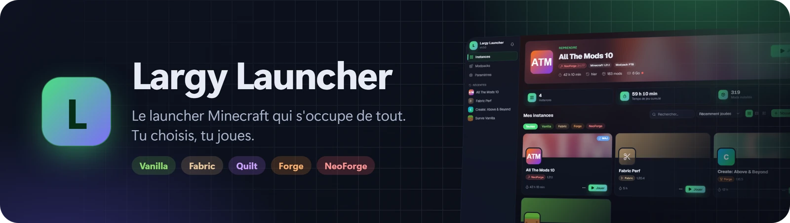
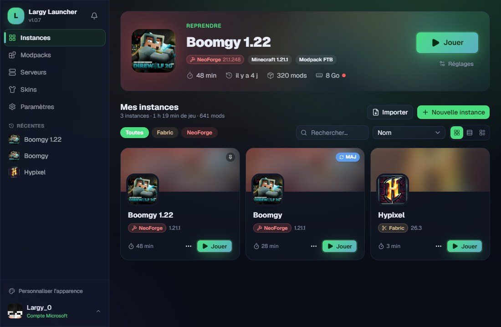
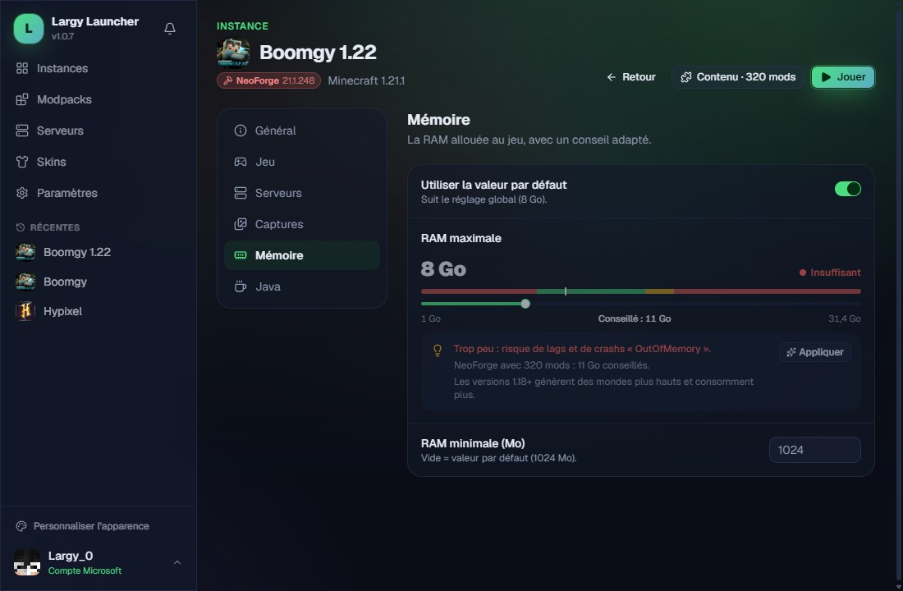
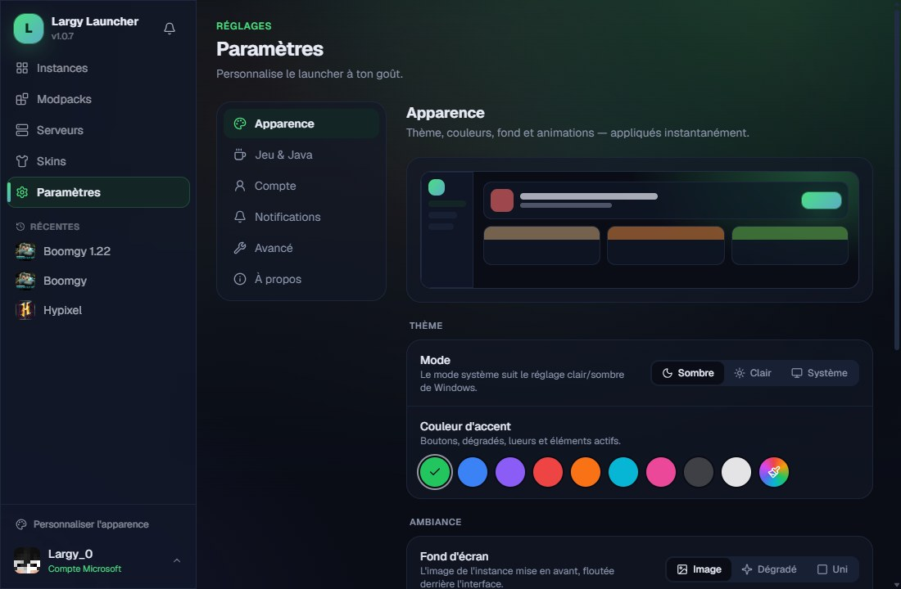
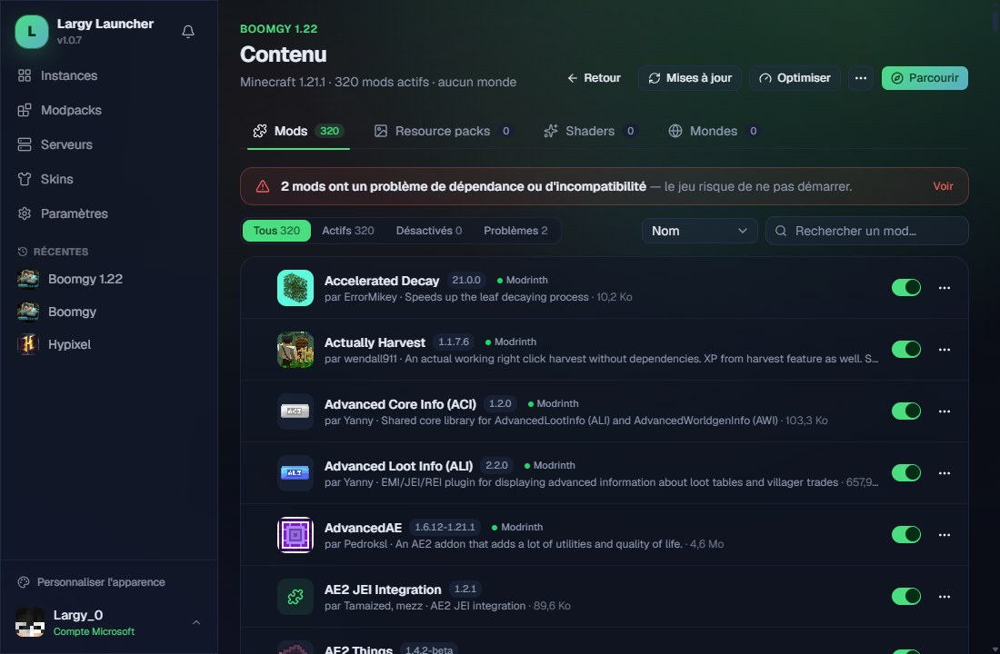
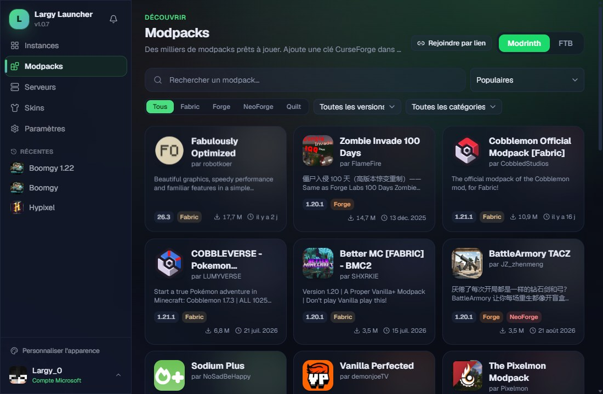
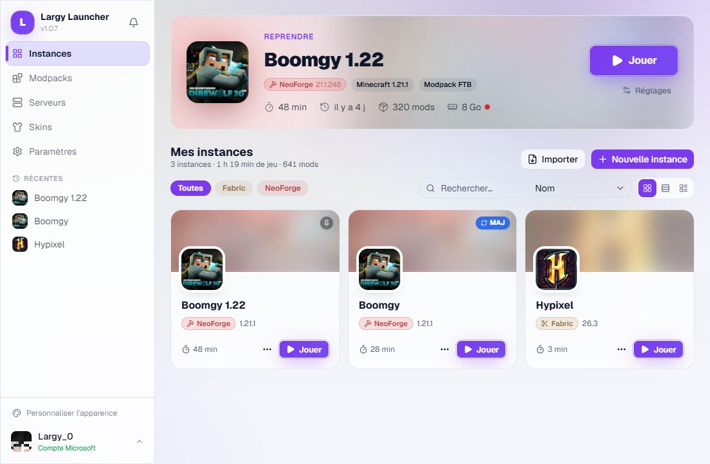

<div align="center">



<br>

<a href="https://github.com/Largy-dev/Largy-Launcher/releases/latest/download/LargyLauncher-Setup.exe">
  
</a>

<sub><a href="https://github.com/Largy-dev/Largy-Launcher/releases">Toutes les versions</a> · Windows 10 et 11 · Gratuit</sub>

<br><br>

**Un launcher Minecraft beau et simple, qui s'occupe de tout.**<br>
Java, mod loaders, modpacks, mods, mémoire, mises à jour… tu choisis ton instance, tu cliques sur **Jouer**.

</div>

<br>



## Sommaire

- [Installer](#installer)
- [Fonctionnalités](#fonctionnalités)
- [Aperçu](#aperçu)
- [Questions fréquentes](#questions-fréquentes)
- [Pour les développeurs](#pour-les-développeurs)

## Installer

1. Télécharge **`LargyLauncher-Setup.exe`** avec le bouton en haut de la page.
2. Lance-le : l'installation prend quelques secondes.
3. Ouvre Largy Launcher et connecte-toi avec ton **compte Microsoft**. C'est tout.

Le launcher **se met à jour tout seul** : quand une nouvelle version sort, il te la propose au
démarrage et l'installe en un clic.

> [!NOTE]
> **Windows affiche « Windows a protégé votre ordinateur » ?** C'est normal pour un logiciel
> indépendant sans certificat payant : clique sur **Informations complémentaires → Exécuter quand
> même**.

## Fonctionnalités

### Jouer

| | |
|---|---|
| **Un clic pour jouer** | La bannière d'accueil reprend ta dernière partie. Java est téléchargé automatiquement, dans la bonne version pour chaque Minecraft. |
| **Tous les mod loaders** | Vanilla, **Fabric**, **Quilt**, **Forge** (y compris 1.7.10 → 1.12.2) et **NeoForge**, chaque instance dans son propre dossier. |
| **Lancement suivi en direct** | Étapes, vitesse de téléchargement et temps restant, puis RAM et processeur pendant la partie. Un lancement peut être annulé à tout moment. |
| **La bonne quantité de RAM** | Une mémoire conseillée par instance, selon le loader, le nombre de mods et la RAM de ton PC. |
| **Directement sur ton serveur** | Rejoins un serveur dès le lancement, choisis la taille de la fenêtre ou le plein écran. |
| **Serveurs populaires** | Hypixel, CubeCraft, Wynncraft, 2b2t… prêts à jouer : la bonne version et les mods utiles (performances, shaders) s'installent en un clic, et le jeu se connecte directement au serveur. |
| **Tes serveurs en direct** | La liste Multijoueur de chaque instance avec joueurs connectés, ping et MOTD en couleurs, et un bouton pour rejoindre en un clic. |
| **Raccourci sur le bureau** | Lance une instance en un double-clic, sans passer par le launcher. |
| **Même sans internet** | Une instance déjà installée se lance hors connexion, avec ton compte Microsoft (en solo). |
| **Toutes les versions** | Les versions stables, mais aussi les snapshots et les vieilles alpha/bêta pour la nostalgie. |
| **Les mêmes touches partout** | En option : tes touches, ta sensibilité, ton FOV et tes volumes te suivent d'une instance à l'autre. |

### Modpacks et mods

| | |
|---|---|
| **Modpacks Modrinth, FTB et CurseForge** | Filtre par version, loader et catégorie, trie par popularité ou nouveauté, installe en un clic. Les nouveautés de chaque version s'affichent avant la mise à jour, qui sauvegarde d'abord tes mondes et garde tes options de jeu. |
| **Packs entre amis** | Un ami met son pack en ligne (un `.mrpack` sur GitHub, Dropbox…) : colle le lien, et l'instance se synchronise toute seule avant chaque partie dès qu'il change. |
| **Tes mods, lisibles** | Vrai nom, icône, version, auteurs et lien vers la page Modrinth ou CurseForge de chaque mod, resource pack et shader. Sélection multiple pour tout activer, désactiver ou supprimer d'un coup. |
| **Problèmes détectés** | Dépendances manquantes et mods déclarés incompatibles entre eux sont signalés avant de lancer ; désactiver un mod dont d'autres ont besoin demande confirmation. |
| **Mods, resource packs et shaders** | Cherche sur Modrinth et CurseForge : seul ce qui est compatible avec ton instance s'affiche, et les dépendances s'installent toutes seules. |
| **Mises à jour sans risque** | Les mods ayant une version plus récente se mettent à jour en un clic, et un point de restauration est créé juste avant : un clic pour revenir en arrière. |
| **Optimiser** | Sodium, Lithium, FerriteCore, ModernFix… les mods de performance adaptés à ton instance, en un clic. |
| **Import et export** | Récupère tes instances du launcher officiel, de Prism/MultiMC, de CurseForge ou de la Modrinth App. Glisse un `.mrpack`, un zip CurseForge ou un export Prism sur la fenêtre. Exporte n'importe quelle instance en `.mrpack`. |

### Au quotidien

| | |
|---|---|
| **Skins et capes** | Aperçu 3D de ton skin, import d'un PNG, bibliothèque pour changer de skin en un clic, choix de la cape. |
| **Captures d'écran** | Toutes tes captures (F2) par instance, en grand, à copier ou supprimer. Ta dernière capture devient la couverture de l'instance (ou l'image de ton choix). |
| **Tes mondes** | Nom, mode et version de chaque monde, sauvegarde et restauration monde par monde, import d'une map `.zip`. |
| **Discord** | Tes amis voient à quoi tu joues et depuis combien de temps. |
| **Plusieurs comptes** | Connecte plusieurs comptes Microsoft et passe de l'un à l'autre depuis la barre latérale. Un mode hors-ligne existe aussi pour jouer sans compte. |
| **Toujours là** | Réduis le launcher dans la zone de notification : il continue de compter ton temps de jeu et de surveiller les crashs. |
| **Comprendre un crash** | Logs colorés et filtrables, diagnostic clair des causes fréquentes (mémoire, mods incompatibles, pilote graphique, Java…) et accès direct au crash report. **Partager** envoie le log sur mclo.gs et copie le lien, prêt à coller sur Discord. |
| **Entretien des instances** | Dupliquer, réparer (vérification de chaque fichier), sauvegarder les mondes, choisir le Java utilisé. |
| **Tes stats** | Temps de jeu par instance et au total, dernière partie, nombre de mods. |
| **À ton goût** | Thème sombre, clair ou système, 9 couleurs d'accent ou la tienne, fond flouté de ton modpack, taille de l'interface, animations réglables. |

## Aperçu

| | |
|---|---|
|  |  |
| **Conseil de RAM** adapté à chaque instance | **Personnalisation** appliquée en direct |
|  |  |
| **Gestion des mods** avec recherche et filtres | **Modpacks** installables en un clic |



## Questions fréquentes

<details>
<summary><b>Faut-il une clé CurseForge ?</b></summary>

<br>

Non : le launcher a sa propre clé, l'onglet CurseForge marche sans rien configurer. Si tu
préfères utiliser la tienne (gratuite, sur [console.curseforge.com](https://console.curseforge.com/)),
colle-la dans **Paramètres › Avancé › Clé API CurseForge**.

Si tu compiles le launcher toi-même, l'onglet n'apparaît qu'avec une clé : renseigne la tienne
dans les paramètres, ou définis la variable d'environnement `CURSEFORGE_API_KEY` avant le build.
</details>

<details>
<summary><b>Des fichiers d'un modpack sont « à télécharger à la main ».</b></summary>

<br>

Certains auteurs CurseForge interdisent le téléchargement par les launchers. Le launcher liste ces
fichiers avec un lien vers leur page : télécharge-les avec ton navigateur, et tant que la fenêtre
reste ouverte, le launcher les repère dans ton dossier Téléchargements, vérifie leur empreinte et
les range tout seul dans l'instance.

Pour un pack publié par FTB (Direwolf20, FTB Skies…), la fiche CurseForge propose directement la
version FTB, qui s'installe sans aucun fichier manuel.
</details>

<details>
<summary><b>Comment jouer au même pack que mes amis ?</b></summary>

<br>

Celui qui prépare le pack l'exporte : **Réglages de l'instance › Exporter en .mrpack**, puis met le
fichier en ligne (GitHub, Dropbox…). Les autres vont dans **Modpacks › Rejoindre par lien** et collent
le lien. Quand le fichier en ligne change, chaque instance se met à jour toute seule avant de jouer.
</details>

<details>
<summary><b>Une mise à jour de mods a tout cassé.</b></summary>

<br>

**Réglages de l'instance › Général › Points de restauration** : un point est créé avant chaque mise à
jour de mods ou du modpack. **Restaurer** remet les mods, configs et versions d'avant.
</details>

<details>
<summary><b>Combien de RAM mettre ?</b></summary>

<br>

Regarde la pastille de couleur dans **Réglages de l'instance › Mémoire** : vert, c'est bon. Le bouton
**Appliquer** met directement la valeur conseillée.
</details>

<details>
<summary><b>Le jeu ne se lance plus ou crash au démarrage.</b></summary>

<br>

Regarde d'abord l'onglet **Contenu › Mods** : un bandeau signale les dépendances manquantes et les
mods incompatibles. Ensuite, **Réglages de l'instance › Général › Réparer** vérifie chaque fichier du
jeu et du mod loader. Si le problème continue, **Partager** sur l'écran de crash donne un lien vers le
log à montrer, et **Paramètres › Avancé › Signaler un problème** prépare un rapport complet.
</details>

<details>
<summary><b>Je veux fermer complètement le launcher.</b></summary>

<br>

Clic droit sur son icône dans la zone de notification → **Quitter**. Le comportement du bouton de
fermeture (demander, réduire ou quitter) se règle dans **Paramètres › Jeu & Java**.
</details>

---

## Pour les développeurs

Construit avec **Tauri 2** (backend Rust) et **React 19 + TypeScript** (interface). Cible : Windows.

### Lancer en local

```bash
npm install
npm run tauri dev
```

Build : `npm run tauri build` → `src-tauri/target/release/bundle/nsis/*-setup.exe`.

### Tests

```bash
# Backend : 330 tests unitaires + lint (régénère aussi les types TypeScript de src/bindings)
cd src-tauri && cargo test && cargo clippy --all-targets -- -D warnings

# Frontend : types, lint, format, 90+ tests Vitest
npx tsc --noEmit && npm run lint && npm run format:check && npm test

# Interface réelle pilotée par Playwright (ferme d'abord le launcher installé)
npx tauri build --debug --no-bundle --config tests/e2e/tauri.e2e.json && npm run test:e2e

# Bout en bout contre les vrais services (~300 Mo, hors CI)
cd src-tauri && cargo test --test smoke -- --ignored --nocapture --test-threads=1
```

Le test de bout en bout installe réellement Java, Fabric, Quilt, Forge 1.20.1 (processeurs
compris), Forge 1.12.2, NeoForge 1.21.1 / 1.20.1, et résout des modpacks Modrinth et FTB.
`LARGY_SMOKE_DIR` permet de garder son cache entre deux lancements.

### Stack

| Techno | Rôle |
|---|---|
| **Tauri 2** | Fenêtre native légère, icône de notification, updater signé, notifications Windows. |
| **Rust** (`src-tauri/`) | Auth, téléchargements, instances, Java, mod loaders, providers, lancement. |
| **React 19 + TypeScript** (`src/`) | Interface. |
| **Tailwind CSS v4 + shadcn/ui** | Styles et composants ; thème par tokens CSS (`src/index.css`). |
| **Motion** | Animations, coupées selon la préférence de l'utilisateur. |
| **TanStack Query / Zustand** | Cache des données du backend / état global et préférences. |
| **reqwest / tokio** | HTTP asynchrone (Mojang, Microsoft, Modrinth, FTB, CurseForge). |
| **keyring** | Tokens Microsoft et Minecraft dans le Gestionnaire d'identification Windows. |
| **ts-rs** | Types TypeScript générés depuis Rust (`src/bindings`) : le front ne peut pas diverger du backend. |

### Comment ça marche

- **Auth** (`auth/`) — flux « device code » Microsoft → Xbox Live → XSTS → Minecraft Services.
  Plusieurs comptes ; le token Minecraft (24 h) est mis en cache, donc pas de requête au démarrage,
  et la session en cache sert de repli sans réseau ou en cas de limite de requêtes (429). Le token
  ne quitte jamais le backend.
- **Téléchargements** (`download/`) — écriture progressive sur disque avec SHA-1 incrémental,
  3 tentatives, fichiers temporaires uniques, vérification rapide (taille) ou complète (réparation).
- **Métadonnées** (`util/http_cache.rs`) — manifestes Mojang, profils de loaders et index Java
  mis en cache avec repli sur la copie locale : une instance installée se lance hors connexion.
- **Mod loaders** (`modloaders/`) — Fabric et Quilt fusionnent un profil JSON ; Forge et NeoForge
  exécutent la chaîne de processeurs de leur installeur (`forge_common/`), avec le format legacy
  pour Forge ≤ 1.12.2.
- **Modpacks** (`providers/`) — trait `ModpackProvider` pour Modrinth (`.mrpack`), FTB et
  CurseForge (résolution groupée). Archives extraites sans zip-slip, chemins toujours validés.
- **Lancement** (`launch/`) — l'instance est verrouillée dès la préparation (annulable), logs
  envoyés par lots, protection Log4Shell, analyse des crashs à la sortie, options partagées.
- **Contenu installé** (`instances/installed/`) — métadonnées lues dans chaque jar/zip et mises en
  cache, identification Modrinth (SHA-1) / CurseForge (empreinte) en arrière-plan, dépendances et
  incompatibilités par loader.
- **Points de restauration** (`instances/snapshots.rs`) — jars liés en dur, configs copiées.

### Structure

```
src-tauri/src/
  auth/          Microsoft, Xbox, Minecraft Services, comptes, coffre de tokens
  download/      moteur de téléchargement
  instances/     instances, contenu installé, Modrinth/CurseForge, mondes, restauration,
                 import (fichiers et autres launchers), export, sauvegardes
  java/          runtimes Mojang et détection des Java installés
  launch/        préparation, lancement, logs, crashs, partage mclo.gs, options partagées
  minecraft/     manifestes, bibliothèques, assets, arguments
  modloaders/    Fabric/Quilt, Forge, NeoForge
  providers/     Modrinth, FTB, CurseForge, packs par lien, archives
  util/          écriture atomique, cache HTTP, versions
src/
  screens/       Instances, Modpacks, Serveurs, Skins, Paramètres, Réglages d'instance,
                 Contenu (mods, packs, shaders, mondes), Lancement
  components/    shell, instance, launch, console, settings, ui
  bindings/      types générés depuis Rust (ne pas éditer)
  hooks/ lib/ store/ services/
tests/e2e/       l'app réelle pilotée par Playwright
```

> [!WARNING]
> Ne nomme jamais un dossier source `logs` : le `.gitignore` l'ignorerait, et Tailwind ne
> scannerait pas ses classes.

### Publier une version

1. Mets la même version dans `package.json`, `package-lock.json`, `src-tauri/Cargo.toml`
   (+ `Cargo.lock`) et `src-tauri/tauri.conf.json`.
2. Tagge et pousse :

```bash
git tag -a v1.0.2 -m "v1.0.2"
git push origin main v1.0.2
```

Le tag déclenche `.github/workflows/release.yml` : vérification que le tag correspond à la
version de l'app, build, release GitHub avec l'installeur, `latest.json` signé pour l'auto-update et
une copie `LargyLauncher-Setup.exe` au nom fixe pour le bouton de téléchargement. Chaque push et pull
request passe par `.github/workflows/ci.yml` (tests, clippy, tsc, lint, format).

**Signature du code** : avec les secrets `AZURE_CLIENT_ID`, `AZURE_CLIENT_SECRET`, `AZURE_TENANT_ID`
et les variables `TRUSTED_SIGNING_ENDPOINT`, `TRUSTED_SIGNING_ACCOUNT`, `TRUSTED_SIGNING_PROFILE`
d'un compte [Azure Trusted Signing](https://learn.microsoft.com/azure/trusted-signing/), la release
signe l'exécutable et l'installeur (plus d'avertissement SmartScreen). Sans eux, elle reste non signée.

**Auto-update** : `tauri-plugin-updater` lit `releases/latest/download/latest.json`. Les artefacts
sont signés avec une clé privée (secret GitHub `TAURI_SIGNING_PRIVATE_KEY`, jamais dans le dépôt) ;
la clé publique est dans `src-tauri/tauri.conf.json`.

### Utiliser ta propre application Azure

L'application Azure du launcher est intégrée et approuvée pour l'API Minecraft. Pour la connexion
dans une fenêtre du launcher (sans code à recopier), ajoute à l'application la plateforme
**Mobile and desktop applications** avec l'URI de redirection
`https://login.microsoftonline.com/common/oauth2/nativeclient` : le launcher le détecte tout seul et
garde sinon la connexion par code. Pour un fork,
enregistre la tienne sur [Entra ID](https://entra.microsoft.com) (App registrations → New
registration, « Allow public client flows » activé), fais-la valider pour l'API Minecraft
([aka.ms/mce-reviewappid](https://aka.ms/mce-reviewappid)), puis mets son identifiant dans
`azure_client_id` du fichier `settings.json` du launcher.
